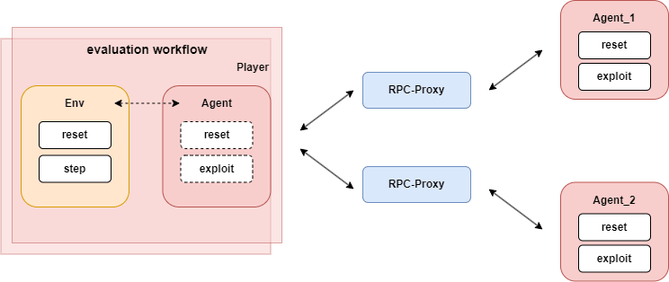
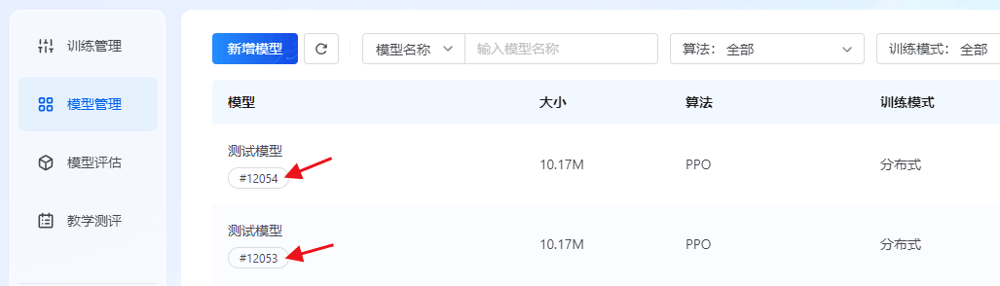

# 智能体详述

我们在代码包中提供了智能体的简单实现，本文将对该部分内容进行讲解，包括观测处理及优化指南等。

## 观测处理

环境返回的`observation`信息包含了针对智能体的局部观测信息，可以在`observation_process`函数中对这些局部观测信息进行处理。

很多情况下，观测信息体量较大且步骤繁多，我们推荐用户基于代码包提供的`process_feature`进行特征处理：

```
def process_feature(self, observation):
    frame_state = observation["frame_state"]

    main_camp_hero_vector_feature = self.process_hero_feature(frame_state)
    organ_feature = self.process_organ_feature(frame_state)

    feature = main_camp_hero_vector_feature + organ_feature

    return feature
```

### 特征处理

通过在程序中调用`env.reset`或`env.step`，环境会返回当前帧的环境状态数据，从中可以获取到英雄血量、技能信息、防御塔信息等数值，基于游戏状态数据，可以处理得到智能体网络推理所需的特征。

以下是特征区间及其维度的详细说明：

| 特征区间名 | 特征维数 | 举例 |
| --- | --- | --- |
| main_camp_hero_vector_feature | 3 | 英雄存活情况、位置 |
| organ_feature | 7 | 敌方防御塔血量、位置 |

代码包中提供了一些特征的实现，可以参考`<agent_算法名称>/feature/feature_process/__init__.py`目录下里的`FeatureProcess`类的设计和实现。`FeatureProcess` 类内部包含了`HeroProcess`，`OrganProcess`等子类，分别用于处理不同单位的特征。

处理特征时，首先会根据当前观测的环境帧数据来保存各个单位的信息，然后从`feature_config`特征配置中读取对应的**特征处理函数**和**特征归一化配置**：

- **特征处理函数**：用于从帧数据中提取特征。
- **特征归一化配置**：通过 one-hot 编码或最大最小值归一化方法，将特征归一化到 0～1 的范围，以便于网络推理计算。

需要注意的是：

- 对于位置特征：考虑到王者1v1中地图相对于游戏双方而言是镜像对称的，在双方眼中其都处于地图左下角，故使用相对位置特征，将处于地图右上角的英雄的特征数据进行镜像反转，将其转换为左下角位置。

### 奖励处理

这里的奖励特指强化学习中的Reward，注意要与环境反馈的Score进行区分。Score用于衡量玩家在任务中的表现，也作为衡量强化学习训练后的模型的优劣。

代码包里提供了一些奖励的实现，可以参考`<agent_算法名称>/feature/reward_process.py`里的`GameRewardManager`类的设计和实现，用户还可以在这个函数中去实现自己的reward设计，这部分非常开放，回报设计的依据不一定只是环境给出的信息，也可以是用户对问题的理解、经验或者知识，建议用户根据对问题和强化学习算法的理解，去设计和实现自己的reward。

参考代码包中GameRewardManager对reward的实现，同学们可以通过设计多个奖励子项来帮助智能体获得更好的效果。以下是推荐设计的奖励子项：

| reward | 存储类型 | 描述 |
| --- | --- | --- |
| hp_point | dense | 英雄生命值比例 |
| tower_hp_point | dense | 防御塔生命值比例 |
| money (gold) | dense | 获得的总金币数 |
| ep_rate | dense | 法力值比例 |
| death | sparse | 英雄被击杀 |
| kill | sparse | 击杀敌方英雄 |
| exp | dense | 获得的经验值 |
| last_hit | sparse | 对小兵的最后一击 |
| forward | dense | 前进奖励 |

其中，`tower_hp_point` 和 `forward` 奖励已在默认代码中实现，大家可以参考其设计思路进行扩展。

#### 回报计算方法

- 部分奖励使用零和reward设计方案，以当前决策帧和上一决策帧的相关数值差作为agent的reward，两个agent的同类reward项相减作为最终reward，最终多种reward项加权求和作为最终的reward返回。回报计算方法不止一种，我们鼓励用户进行创新。

### 召唤师技能选择

智能体在**对局初始化阶段**，需根据双方英雄信息自主选择一个召唤师技能，选择发生在 `env.reset()` 之前。

### 选择流程

```
usr_conf = load_usrconf()

for camp in camps:
    summoner_skill_id = agents[camp].init_config(lineups)
    usr_conf[camp]["summoner_skill_id"] = summoner_skill_id

# 对局初始化
env_obs = env.reset(usr_conf)
for camp in camps:
    act = agents[camp].reset(env_obs)

# 常规对战循环
while not done:
    action = []
    for camp in camps:
        act = agents[camp].exploit(env_obs)
        action.append(act)
    env_reward, env_obs = env.step(action)
```

### init_config 接口

Agent 新增 `init_config()` 方法，用于在初始化阶段选择召唤师技能：

```
def init_config(self, lineups) -> dict:
    """
    在对局初始化阶段选择召唤师技能。

    Args:
        lineups: 双方英雄ID

    Returns:
        int: summoner_skill_id
    """
```

### 召唤师技能列表

| 技能名称 | 技能ID | 效果描述 |
| --- | --- | --- |
| 治疗术 | 80102 | 立即恢复英雄一定量的生命值 |
| 晕眩 | 80103 | 对身边所有敌人施加眩晕效果，使其短暂无法行动 |
| 惩击 | 80104 | 对身边的野怪和小兵造成真实伤害并眩晕 |
| 干扰 | 80105 | 沉默敌方机关使用，使其短暂无法进行攻击 |
| 净化 | 80107 | 解除自身所有负面和控制效果并暂时免疫控制效果 |
| 终结 | 80108 | 对低血量敌方英雄造成基于其已损失生命值的真实伤害 |
| 疾跑 | 80109 | 短时间内大幅提升英雄移动速度 |
| 狂暴 | 80110 | 短时间内提升英雄物理吸血和法术吸血 |
| 闪现 | 80115 | 向指定方向位移一段距离 |
| 弱化 | 80121 | 减少身边敌人伤害输出 |

---

## 算法介绍

我们在王者1v1代码包中提供了1个核心算法 **PPO**，同时，我们还提供了一个**diy**模板算法文件夹，用户可在该文件夹中自定义算法实现。

### PPO 算法

PPO算法，是一种通过截断策略更新幅度平衡训练效率与稳定性的强化学习算法，核心思想是“小步多次更新，避免策略崩溃”。

## 算法监控信息

| 指标名称 | 说明 |
| --- | --- |
| reward | 对局的累积回报，反应了智能体的能力，正常训练情况下指标应该是震荡向上。 |
| total_loss | 算法计算的所有loss总和。 |
| value_loss | 算法计算的值函数的loss。 |
| policy_loss | 算法计算的决策动作概率的loss。 |
| entropy_loss | 策略的概率分布计算得到的熵loss。 |

## 模型保存限制策略

为了避免用户保存模型的频率过于频繁，开悟平台对模型保存会有安全限制，不同的任务会有不同的限制，限制规则详情如下：

- 保存模型的频率限制: 2次/分钟
- 单个任务保存模型的次数限制：400次

## 模型评估模式

评估时用户需要在提交任务界面进行配置，包括选择的对手模型、评估局数。另外，训练模式时，用户一般使用`agent.predict`方法进行决策；而在评估模式时，平台会调用`agent.exploit`方法进行决策，一般情况下，模型在训练和评估时的决策会因算法不同和用户设计不同，而有不同的行为，这部分由用户定义和实现。

评估时将会分别启动两个智能体容器作为AI服务，这个服务只有两个接口即`agent.reset`和`agent.exploit`，`agent.reset`的输入为环境`env.reset`返回的`observation`，仅在每局环境reset时调用一次；`agent.exploit`的输入即环境`env.step`返回的`observation`，输出作为环境下一个`env.step`的输入，评估的workflow会分别调用两个智能体的agent.exploit方法进行对战，最后根据智能体胜负情况进行模型能力的判定。以上过程可以描述为下图：



## 训练中评估模式

我们支持在训练过程中以一定的局数间隔与common_ai或用户指定的对手模型进行对战评估，以反映当前训练模型对对战水平的提升。 用户需要在usr_conf中设置`monitor_side`作为被评估对象，另一个智能体作为评估的对手，训练时评估的数据将会在监控中展示。

评估时的对手模型可以选择以下两种：

1. common_ai：这是内置在环境中的一个由规则实现的 AI，其能力是固定的。
2. 用户自定义模型：用户可以将期望用作对手模型的模型 ID 配置在 kaiwu.json 中（模型 ID 可以在平台的模型管理中查看）,通过`agent.load_opponent_agent()`加载期望的模型。我们最多支持配置 3 个模型，但在一次训练中，建议只选择其中一个模型作为评估的对手。

以下是kaiwu.json的配置示例：

```
{
    "model_pool": [12053, 12054]
}
```

下图是开悟平台模型管理的截图，我们可以将模型id写入kaiwu.json用于训练时的评估。



> **注意**：如果选择使用对手模型，那对手模型只能是当前兼容版本的模型，如果版本存在变更导致不兼容性问题，强行使用会导致`加载模型失败`的报错。

---
