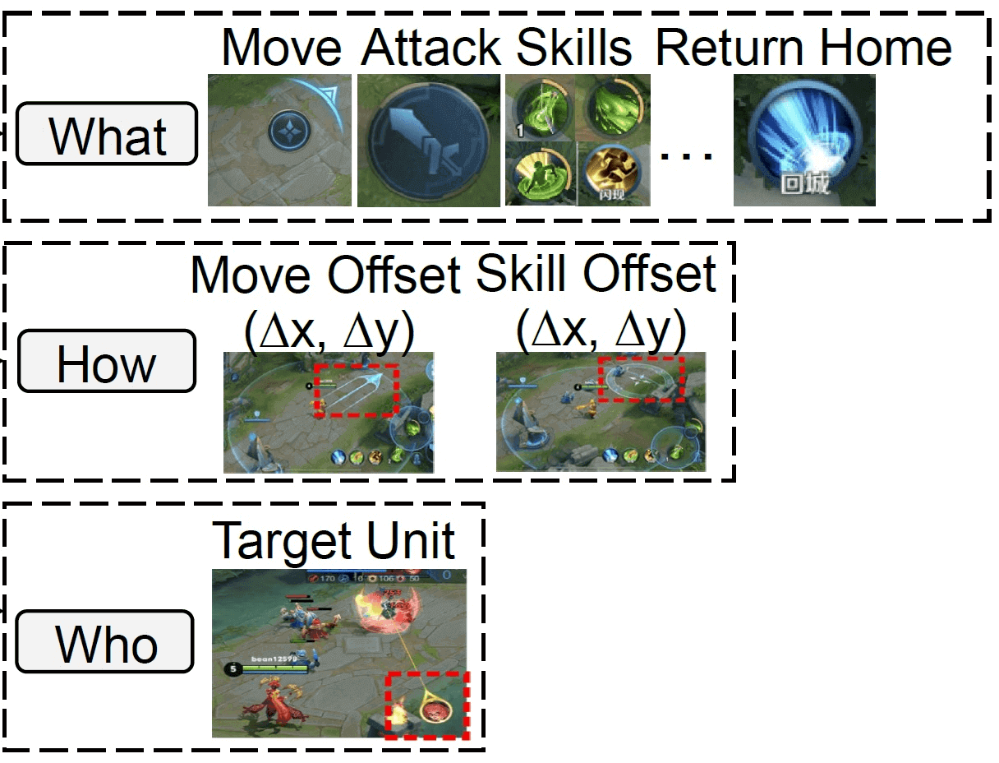
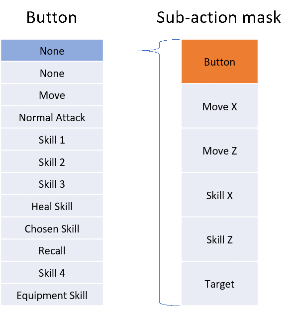
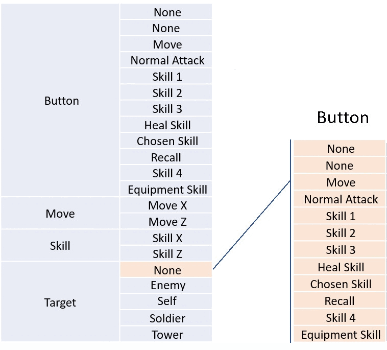
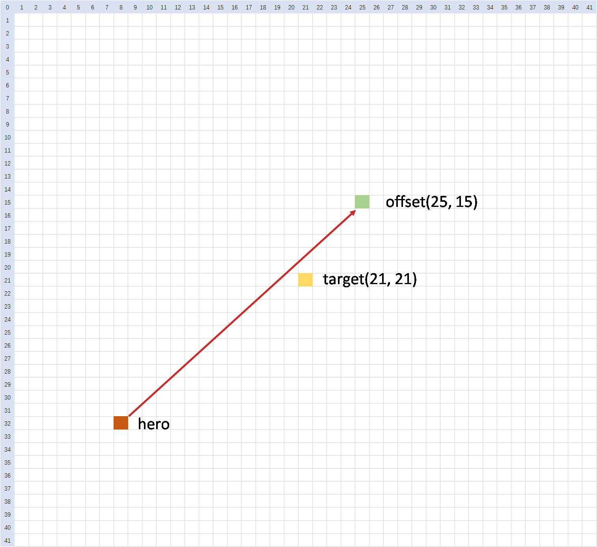

# 环境详述

## 环境配置

在智能体和环境的交互中，首先会调用`env.reset`方法，该方法接受一个`usr_conf`参数，这个参数通过读取`agent_算法名/conf/train_env_conf.toml`文件的内容来实现定制化的环境配置。因此，用户可以通过修改`train_env_conf.toml`文件中的内容来调整环境配置。

```
# 读取 train_env_conf.toml 得到 usr_conf，此处以 agent_ppo 为例
usr_conf = read_usr_conf("agent_ppo/conf/train_env_conf.toml", logger)

# env.reset 返回一个 dict：{observation, extra_info, ...}
env_obs = env.reset(usr_conf=usr_conf)
observation = env_obs["observation"]
extra_info = env_obs["extra_info"]
```

`train_env_conf.toml`中包含以下信息：

| 数据名 | 数据类型 | 取值范围 | 默认值 | 数据描述 |
| --- | --- | --- | --- | --- |
| monitor_side | int | [0, 1] | 0 | 监控上报的阵营，0 表示蓝方阵营，1 表示红方阵营 |
| auto_switch_monitor_side | bool | true/false | true | 是否启用自动换边逻辑 |
| opponent_agent | string | selfplay / common_ai / 自定义模型id | selfplay | 对手智能体类型。selfplay：自对弈；common_ai：与规则AI对战；自定义模型id：与指定模型对战 |
| eval_interval | int | >=1 | 10 | 评估间隔（单位：局） |
| eval_opponent_type | string | selfplay / common_ai / 自定义模型id | common_ai | 评估对手类型 |
| hero_id（蓝方） | int | 112 / 133 / 199 | 112 | 蓝方英雄ID：112=鲁班七号，133=狄仁杰，199=公孙离 |
| hero_id（红方） | int | 112 / 133 / 199 | 112 | 红方英雄ID：112=鲁班七号，133=狄仁杰，199=公孙离 |

具体使用方式请参考下方提供的默认示例

```
[monitor]
# 监控上报的阵营，类型整型，取值范围[0,1]
# 0表示蓝方阵营，1表示红方阵营
monitor_side = 0

# Auto switch monitor side, Type: boolean, value range: [true, false]
# 是否启用自动换边逻辑，类型布尔值，true表示开启，false表示关闭
auto_switch_monitor_side = true

[episode]
# 对手智能体，类型字符串，取值范围[selfplay, common_ai, 自定义模型id]
# 1. selfplay：自对弈
# 2. common_ai：与基于规则的common_ai对战
# 3. 自定义的模型id：与指定的模型对战，需要先将模型上传至模型管理，并且将模型ID配置在kaiwu.json中，然后在此处进行引用
opponent_agent = "selfplay"

# 评估间隔(单位局)，类型整型，取值范围为大于等于1的整数
eval_interval = 10

# 评估对手类型，类型字符串，取值范围为[selfplay, common_ai, 自定义模型id]
# 值的含义请参考opponent_agent注释
eval_opponent_type = "common_ai"

# 蓝方阵容配置
[[lineups.blue_camp]]
# 英雄ID，类型整数，取值范围: 112:鲁班七号，133:狄仁杰，199:公孙离
hero_id = 112

# 红方阵容配置
[[lineups.red_camp]]
# 英雄ID，类型整数，取值范围: 112:鲁班七号，133:狄仁杰，199:公孙离
hero_id = 112
```

> **💡 补充说明**：
>
> 1. **`train_env_conf.toml`文件中的配置仅在训练时生效**，请按上表数据描述进行配置。若配置错误，训练任务会变为"失败"状态，此时可以通过查看**env模块的错误日志**进行排查。
> 2. 若需调整模型评估任务时的配置，用户需要通过腾讯开悟平台创建评估任务并完成环境配置，详细参数见[智能体模型评估模式](./agent_lite.md#%E6%A8%A1%E5%9E%8B%E8%AF%84%E4%BC%B0%E6%A8%A1%E5%BC%8F)。

## 环境信息

调用`env.step`接口时，会返回 `(env_reward, env_obs)` 两个 dict：

```
env_reward, env_obs = env.step(actions)
```

- `env_reward`：训练侧回报数据（非比赛分数）
- `env_obs`：环境观测数据，结构如下表：

| 数据名 | 数据类型 | 数据描述 |
| --- | --- | --- |
| frame_no | int32 | 当前环境实例运行时的帧数 |
| observation | Observation | 环境实例针对智能体提供的观测信息 |
| terminated | int32 | 当前环境实例是否结束 |
| truncated | int32 | 当前环境实例是否异常或中断 |
| extra_info | ExtraInfo | 环境实例的可选额外信息 |

调用`env.reset`可以重置环境，此时，只返回 env_obs。

下面会对这些数据进行介绍，完整的观测数据结构可以参考[数据协议](./protocol.md).

### 观测信息（observation）

`observation`是环境实例针对智能体返回的原始信息，按照阵营进行区分。`observation[agent_id]`对应的具体描述如下：

| 数据名 | 数据描述 |
| --- | --- |
| env_id | 对局id |
| player_id | 英雄运行时id, 作为英雄的唯一标识 |
| player_camp | 英雄所属阵营 |
| legal_action | 合法动作 |
| sub_action_mask | 不同动作（button）对应的合法子动作（move、skill、target） |
| frame_state | 环境帧状态 |
| win | 是否获胜 |

#### 环境帧状态（frame_state）

| 数据名 | 数据描述 |
| --- | --- |
| frame_no | 当前帧号 |
| hero_states | 当前帧中所有英雄状态构成的集合 |
| npc_states | 当前帧中所有 NPC 状态构成的集合（小兵、防御塔、野怪等） |
| bullets | 当前帧中所有子弹状态构成的集合 |
| cakes | 当前帧中所有功能物件（神符等）的集合 |
| frame_action | 本帧发生的事件（目前仅包含死亡事件） |
| map_state | 地图状态（1v1 默认不使用） |

完整字段结构见[数据协议](./protocol.md#aiframestate--%E5%B8%A7%E7%8A%B6%E6%80%81)。

### 额外信息（extra_info）

环境会提供部分额外信息，训练时作为提供给智能体的观测信息的补充，评估时无法获取。在本环境中，额外信息仅包含了环境的错误码和错误信息，因此不会在训练和评估时传输给智能体使用。

### 动作空间

王者1v1强化项目使用层次化的动作空间，将所有动作分为以下几类：

- what，你要按哪个按键：**12个button**
- how，你要往哪个方向拖动按键：**16*16个方向选择**
- who，你的技能作用对象是谁：**9个target（None，敌方英雄，自身英雄，防御塔，4个小兵，1个野怪）**



#### 动作空间各维度说明

| Action Class | Type | Description | Dimension |
| --- | --- | --- | --- |
| Button | None | 非法动作 | 1 |
| None | 无动作 | 1 |  |
| Move | 移动 | 1 |  |
| Normal Attack | 释放普通攻击 | 1 |  |
| Skill 1 | 释放第1个技能 | 1 |  |
| Skill 2 | 释放第2个技能 | 1 |  |
| Skill 3 | 释放第3个技能 | 1 |  |
| Heal Skill | 释放恢复技能 | 1 |  |
| Chosen Skill | 释放召唤师技能 | 1 |  |
| Recall | 释放回城技能 | 1 |  |
| Skill 4 | 释放第4个技能(仅特定英雄有效) | 1 |  |
| Equipment Skill | 释放特定装备提供的技能 | 1 |  |
| Move | Move X | 沿X轴移动方向 | 16 |
| Move Z | 沿Z轴移动方向 | 16 |  |
| Skill | Skill X | 技能沿X轴方向 | 16 |
| Skill Z | 技能沿Z轴方向 | 16 |  |
| Target | None | 空目标 | 1 |
| Enemy | 敌方英雄 | 1 |  |
| Self | 自身英雄 | 1 |  |
| Soldier | 最近的四个小兵 | 4 |  |
| Tower | 最近的防御塔 | 1 |  |
| Monster | 最近的野怪 | 1 |  |

#### Action Mask 机制

**Sub action mask**（对应 `observation[agent_id]["sub_action_mask"]`）：

该机制根据当前按钮（button）类型，对剩余动作（action）进行选择性过滤。

**原因**：并非所有技能都需要拖动按键，也并非所有技能都有目标（target）。

举例说明：

- 以貂蝉为例，其1技能和2技能是方向性技能，因此当预测按钮为 `skill1` 或 `skill2` 时，`skill X` 与 `skill Z` 的预测结果是有意义的。
- 而对于貂蝉的3技能，`skill X` 与 `skill Z` 的预测结果则没有意义，应予以过滤。



**Legal action mask** (对应`observation[agent_id]["legal_action"]`):

- 根据游戏规则，直接屏蔽不合法或不可执行的动作预测。例如：处于冷却状态（CD）中的技能无法释放，因此对应动作会被屏蔽。该机制能够加快训练速度，避免模型进行无意义的动作探索，提高训练效率。



#### action具体的执行流程

AI选取action的流程如下：

1. 选择执行的动作类型（which_button） 从`which_button`维度中，选取值最大的索引对应的合法动作（legal action），作为英雄下一步要执行的动作。
2. 根据所选动作类型，确定动作参数的计算方式：

动作参数的计算根据技能类型分为以下几类：

1. 方向型技能：需要读取位置偏置`offset_x`, `offset_z`和`target`
2. 位置型技能：需要读取位置偏置`offset_x`, `offset_z`和`target`
3. 目标性技能：只需读取target

**示例：方向型技能的执行过程**



- 橙色方块为main_hero的位置，黄色方块为选中的target的位置。
- 我们以target位置作为offset坐标系的中心点，因此它在offset维度对应的索引为(21, 21)。
- 然后，我们根据offset_x，offset_z的找到最终的位置（下例中以offset_x=25,offset_z=15为例），图中绿色即为以黄色点为中心，offset为(25, 15)的最终目标位置。
- 那么连接橙色的英雄位置和绿色方块位置的红色箭头方向即为实际技能释放方向。

**备注：**

- 这里如果直接把 `(skill_x, skill_z)` 设置成 `(21, 21)`, 技能的释放方向就是目标所在的位置
- 这里图示例子的`offset_x`和`offset_z`是 42 * 42 的, **在1v1的环境中, 应该是 16 * 16**
- `move_x`和`move_z`同理, 当action为move的时候, 以自身为`target`

### 观测视野范围

环境存在战争迷雾机制，智能体只能观测到属于己方阵营的单位，或者处于己方阵营单位视野范围内的敌方单位和建筑。视野范围由单位的视野半径决定，超出视野范围的敌方单位和建筑将不可见。

### 时间信息

帧(frame)和步(step)存在一定映射关系。

**帧**是场景的一个时间单位，表示场景的一个完整更新周期。在每一帧中，场景的所有元素(如英雄状态等)都会根据当前的状态和输入进行更新。

**步**是强化学习环境中的一个时间单位，表示智能体(agent)在环境中执行一个动作并接收反馈的过程。在每一步中，智能体选择一个动作，环境根据该动作更新状态，并返回新的状态、奖励和终止信号。

在本环境中，1 个 step 由 6 个 frame 组成。这意味着每个动作对应一个步，在每一步中，智能体将在六个连续的帧中执行同一个动作。环境将在每一步结束后更新状态并返回反馈，场景只有在完成六帧后，环境状态才会返回一次状态的更新。

- **步更新**：在每一步中，智能体选择一个动作，环境更新状态并返回。
- **帧更新**：在一步中，场景进行六次帧更新，更新所有场景中对象的状态并渲染新的画面。

帧(frame)，步(step)，仿真时间秒(s)和仿真时间毫秒(ms)的关系如下：

1 frame 约等于 33 ms

1 step 执行 6 frame

1 s 等于 1000 ms

## 环境监控信息

监控面板中包含了**env**模块，表示**环境指标**数据。王者荣耀1v1 分为 **self-play** 和 **eval** 两种模式的监控指标，详细说明如下。

### self-play 指标

| 面板中文名称 | 面板英文名称 | 指标名称 | 说明 |
| --- | --- | --- | --- |
| 胜率 | win_rate | win_rate | 每局任务结束时，在 monitor_side 视角下获得任务胜利即为1，失败为0，超时为0.5 |
| 防御塔血量 | tower_hp | self_tower_hp / enemy_tower_hp | 每局任务结束时，两边阵营防御塔剩余的血量，可以反映智能体的推塔能力 |
| 任务总帧数 | frame | frame | 每局任务结束时，该局任务的总帧数 |
| 经济 | money_per_frame | money_per_frame | 每局任务结束时，在 monitor_side 视角获得 money 的总量除以对局总帧数 |
| 击杀/死亡数 | K/D | kill / death | kill：单局内我方英雄击杀敌方英雄的计数；death：单局内我方英雄被击杀的计数 |
| 伤害 | hurt_per_frame | hurt_by_hero / hurt_to_hero | hurt_by_hero：每帧受到来自敌方英雄的伤害；hurt_to_hero：每帧对敌方英雄造成的伤害 |

### eval 指标

与 self-play 指标相同，通过 label 区分对手类型，例如 `win_rate:common_ai`、`win_rate:{model_id}`。

---
